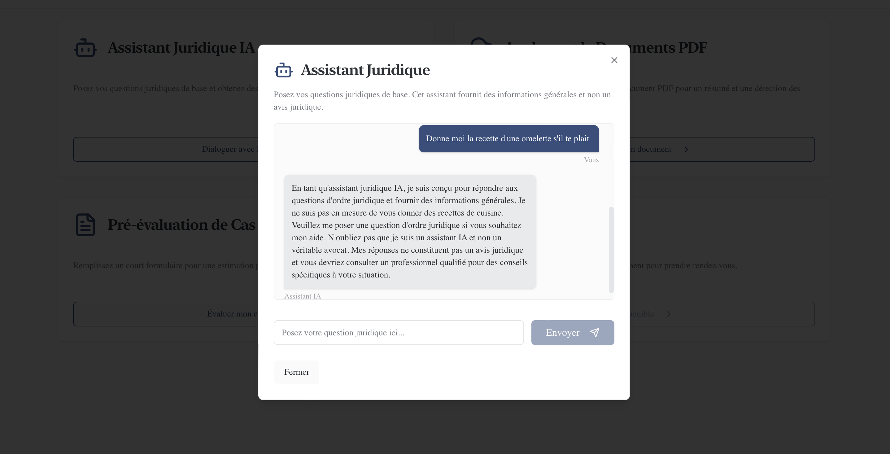
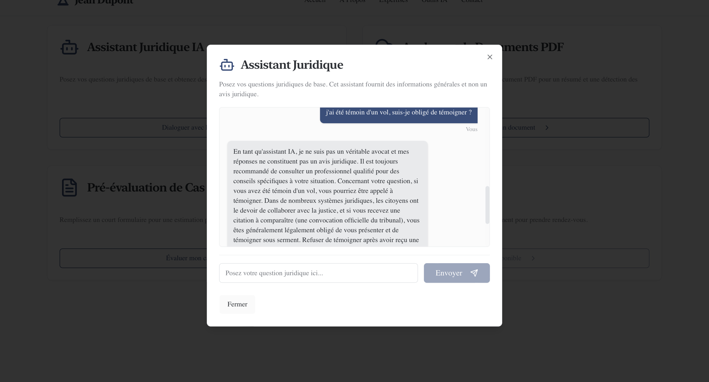
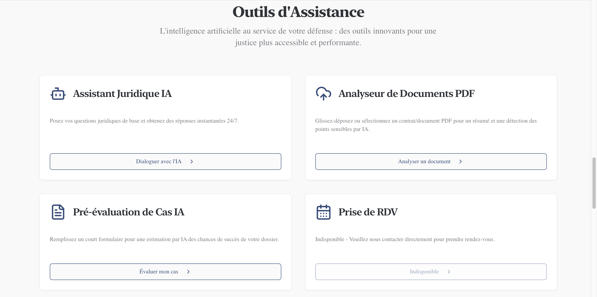

# Application Web — Cabinet d’Avocat


## Présentation

Cette application web simule l’interface d’un cabinet d’avocat moderne, avec une attention particulière portée à l’expérience utilisateur et à l’intégration d’outils interactifs.

L’objectif du projet était de concevoir une interface claire, fonctionnelle et cohérente, permettant à un utilisateur :
- de comprendre rapidement les services proposés
- d’interagir avec des outils d’assistance
- de contacter facilement le cabinet

---

## Fonctionnalités

### Interface principale
- Présentation du cabinet et de ses domaines d’expertise
- Navigation fluide
- Design structuré et lisible

### Formulaire de contact
- Envoi de messages
- Validation des champs
- Gestion des erreurs

### Outils d’assistance

- Assistant interactif (chat)
- Analyse de documents PDF
- Pré-évaluation de cas
- Prise de rendez-vous (désactivée)

---

## Aperçu

### Outils d’assistance


### Assistant — interaction


### Exemple de réponse


---

## Test rapide

Exemple d’interaction avec l’assistant :

**Question :**
> j’ai été témoin d’un vol, suis-je obligé de témoigner ?

**Réponse :**
L’interface retourne une réponse structurée expliquant que, selon le contexte juridique, une personne peut être amenée à témoigner, notamment en cas de convocation officielle.

---

## Démo en ligne

https://avocat-ia-two.vercel.app/#outils-ia

---

## Stack technique

- Next.js
- React
- TypeScript
- Tailwind CSS
- ShadCN UI

---

## Structure du projet

- `src/app` : pages principales  
- `components` : composants réutilisables  
- `app/actions` : logique serveur  
- `public` : assets statiques  

---

## Lancer le projet

```bash
npm install
npm run dev
